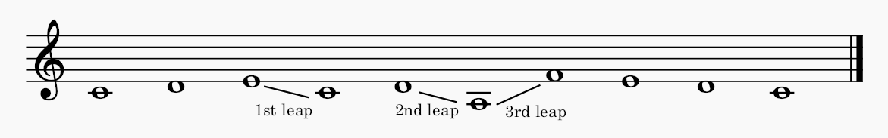

# Cantus Firmus Generator

This CLI program generates all possible Cantus Firmi that adhere to the rules of strict style and saves them to a MusicXML file.

## Features

- Generation of Cantus Firmi of a specified length (8 to 16 notes).
- Selection from several musical modes (major, dorian, phrygian, lydian, mixolydian, minor, locrian).
- Specification of the desired number of leaps in the Cantus Firmus.
- Filtering of results based on strict style rules.
- Saving generated Cantus Firmi to a MusicXML file.
- Option to choose how many Cantus Firmi to save (random selection if the number is less than the total).

## Example
Here is an example of a generated Cantus Firmus with the parameters: length 10, major mode, and 3 leaps.


## Cantus Firmus Rules

- Starting and ending on the tonic.
- Predominantly stepwise motion with a limited number of leaps.
- Leaps greater than a third must be compensated by motion in the opposite direction.
- Absence of excessive repetition of individual notes and note patterns.
- The upper and/or lower climaxes are reached only once.
- Absence of augmented or diminished intervals, including in melodic contours.
- For minor mode, the 6th and 7th degrees are raised when necessary.

### How to Install and Run:

1. **Install Prerequisites**  
   - Install [Go](https://golang.org/dl/)
   - Install [Git](https://git-scm.com/downloads)

2. **Clone the Repository**  
   ```bash
   git clone https://github.com/sergei-shchetnikov/go-cantus-firmus
   ```

3. **Navigate to Project Directory**  
   ```bash
   cd go-cantus-firmus/cmd
   ```

4. **Run the Program**  
   Execute the following command:
   ```bash
   go run main.go
   ```

The program will ask you questions in the console:

1. Desired length of the Cantus Firmus (from 8 to 16 notes).
2. Mode (major, dorian, phrygian, lydian, mixolydian, minor, locrian).
3. Desired number of leaps.

After entering the data, the program will generate Cantus Firmi and ask how many of them to save. The MusicXML file will be saved in the current directory with a name including generation parameters and a timestamp, for example: `cantus_length10_major_leaps1_20250621_150405.musicxml`.

## License

MIT

## Author

Sergei Shchetnikov